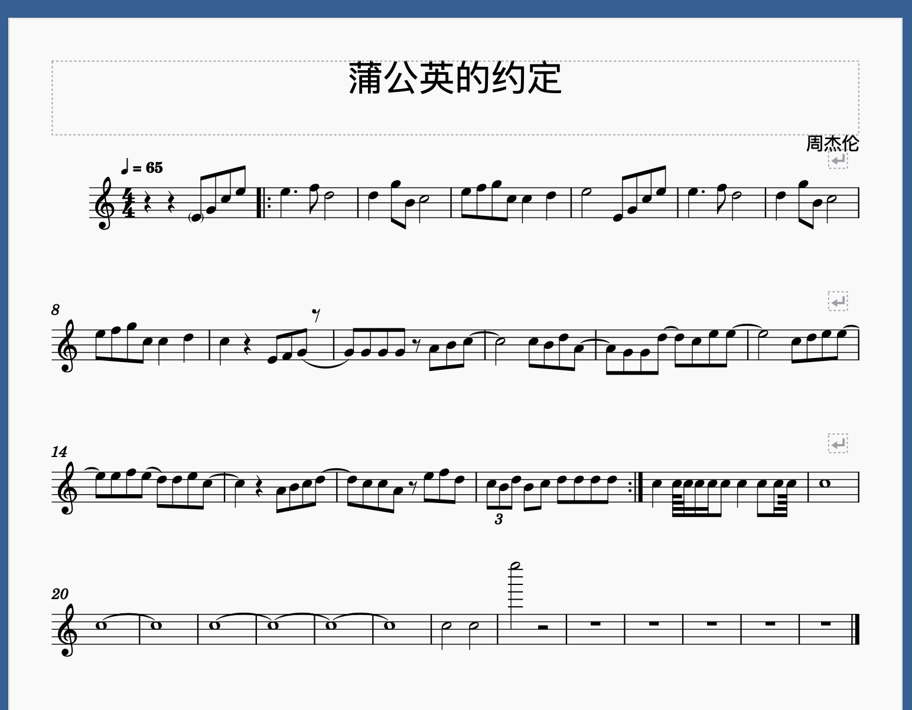
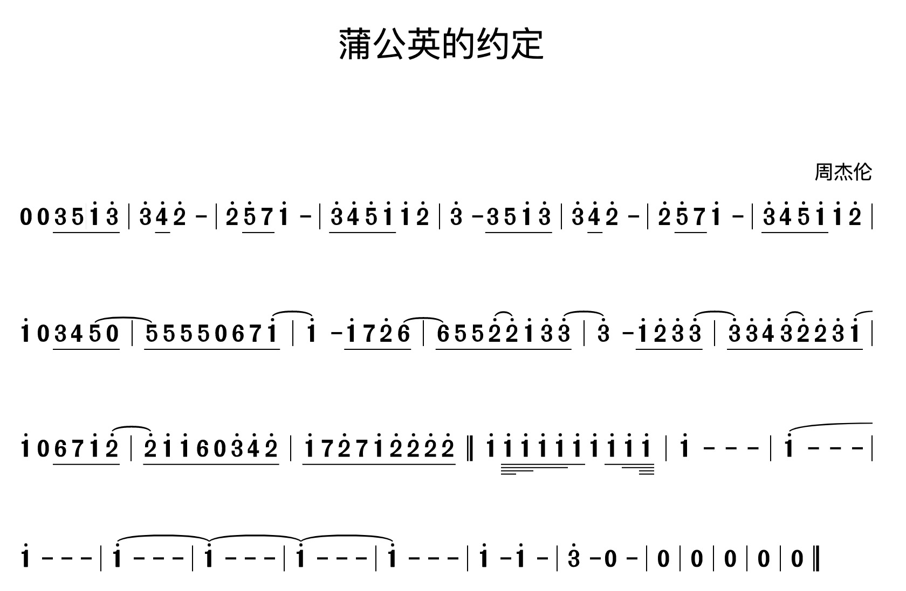

# MuseScore
Yet another musicxml render written in JS

[](https://www.gnu.org/licenses/gpl-3.0.en.html)

## Features
- render numbered musical notation
- support musicxml

## Examples
### edit musical notation in museScore client and export as musicxml

### load musicxml and get an DOM element to render museScore

```
import museScore from 'packages/score';
import transfer from 'packages/xml-transfer';

window.onload = (() => {
  fetch('./assets/pugongying.musicxml').then(data => {
    return data.text();
  }).then((xml) => {
    const testJson = transfer(xml);
    museScore(
      { 
        selector: '#museScoreView',
        scoreData: testJson,   
        config: {
        mode: 'single',
        withEdit: true,
      },
    })
  });
});

```

### you will get the numbered musical notation as the following



## Roadmap
- [ ] use typescript
- [ ] use rematch instead of redux
- [ ] support render multi-voice
- [ ] support render five-line staff
- [ ] have editing function
